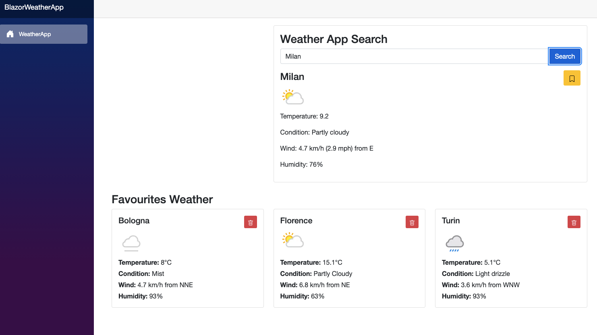

# Weather App



## Description

Simple weather application developed to practice with C# .NET, Entity Framework Core, and MySQL.

## Tech stack

- **C# .NET**
- **Blazor**
- **Entity Framework Core**
- **MySQL**

## Local Setup

Create account [Weather api](https://www.weatherapi.com/)

1. Clone the repository:
   ```bash
   git clone https://github.com/tuousername/weatherapp-cs.git
   cd weatherapp-cs
   ```

2. Configure User Secrets for API keys:
   ```bash
   dotnet user-secrets set "WeatherApi:ApiKey" "your-api-key"
   dotnet user-secrets set "WeatherApi:BaseUrl" "your-api-key"
   dotnet user-secrets set "ConnectionStrings:DefaultConnection" "Server=localhost;Database=weatherdb;User=root;Password=yourpassword;"
   ```

3. Apply database migrations:
   ```bash
   dotnet ef database update
   ```

4. Run the application:
   ```bash
   dotnet watch run
   ```

## Features

- Weather search by city
- Display temperature, humidity, and weather conditions
- Search history saved in MySQL database
- Responsive interface with Blazor

## Learning Objectives

This project was created to learn:

- Web application development with C# and Blazor
- Using Entity Framework Core for ORM
- Integration with MySQL databases
- External API management
- Best practices for secrets and configuration management
